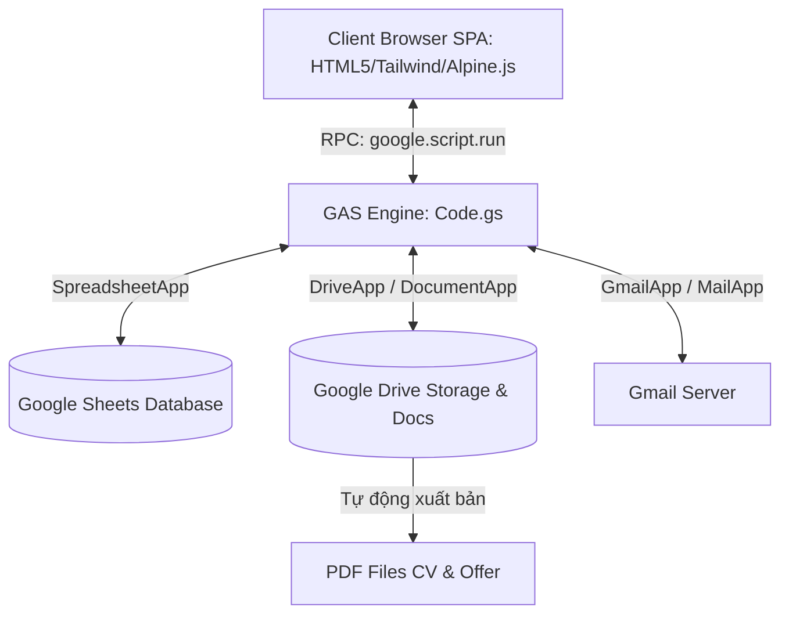

# Tài liệu Kiến trúc Hệ thống RecruitFlow
**Dự án: Hệ thống Quản lý Tuyển dụng tự động hóa (Recruitment Management Web App)**

Hệ thống được phát triển trên nền tảng **Google Apps Script (GAS) Web App**, sử dụng **Google Sheets** làm cơ sở dữ liệu (Database), **Google Drive** để lưu trữ CV & tài liệu ứng viên, **Gmail API** để quét hồ sơ và tự động gửi thư điện tử liên kết **Google Forms** & tự sinh tệp **PDF Offer Letter**.

---

## I. Tổng quan Kiến trúc

Hệ thống được thiết kế theo mô hình **Single Page Application (SPA)** chạy trên trình duyệt client, giao tiếp bất đồng bộ với Backend (Google Apps Script) thông qua giao thức RPC được tối ưu hóa.



---

## II. Bản đồ và Cấu trúc Tệp tin

Dự án được phân tách thành các thành phần front-end và back-end chạy phẳng (Flat Structure) để tương thích với trình soạn thảo Google Apps Script:

### 1. Phân vùng Backend (Server-side)
*   **[Code.gs](file:///Users/suns/Downloads/AppScripts/Application%20HR/Code.gs)**: Chứa toàn bộ logic xử lý chính của server:
    *   `doGet()`: Điểm đầu vào chính (Entry point) trả về giao diện `Index.html`.
    *   `authenticate()`, `login()`, `changePassword()`: Xác thực tài khoản, mã hóa SHA-256 mật khẩu và lưu bộ nhớ đệm `CacheService`.
    *   `initializeDatabaseV2()`: Khởi tạo/Migrate cấu trúc bảng dữ liệu (Google Sheets) tự động.
    *   `scanEmails()`: Lọc Gmail, tải CV lên Google Drive và ghi thông tin ứng viên thô.
    *   `updateCandidateStatus()`: Cập nhật trạng thái ứng viên, tự sinh PDF Offer và gửi thư tự động.
    *   `generatePDF()`: Sao chép tệp mẫu Doc, thay thế thẻ placeholder bằng dữ liệu thực và xuất PDF.
    *   `createAppForm()`: Tự tạo biểu mẫu khảo sát Google Form và liên kết lưu phản hồi trong bảng tính.

### 2. Phân vùng Frontend (Client-side)
*   **[Index.html](file:///Users/suns/Downloads/AppScripts/Application%20HR/Index.html)**: Khung xương giao diện (Main Layout SPA) chứa thanh menu điều hướng, các màn hình chức năng chính và các Modal xem trước tài liệu.
*   **[Styles.html](file:///Users/suns/Downloads/AppScripts/Application%20HR/Styles.html)**: Định nghĩa toàn bộ hệ thống CSS tùy chỉnh hỗ trợ cơ chế giao diện sáng/tối (Dark/Light theme overrides), hiệu ứng kính mờ (Glassmorphism), và định dạng trình soạn thảo văn bản Quill Rich Text.
*   **[CommonJS.html](file:///Users/suns/Downloads/AppScripts/Application%20HR/CommonJS.html)**: Động cơ điều phối JavaScript của Client:
    *   Quản lý bộ từ điển dịch đa ngôn ngữ (VI/EN) qua thuộc tính `data-i18n`.
    *   Bộ định tuyến SPA chuyển đổi hiển thị màn hình (`navigateTo`).
    *   Hàm bọc RPC Promise (`runBackend`) thay thế cơ chế callback lồng nhau.
    *   Tích hợp trình soạn thảo Quill và gọi các modal nghiệp vụ.
*   **[Login.html](file:///Users/suns/Downloads/AppScripts/Application%20HR/Login.html)**: Giao diện form xác thực người dùng (Vanilla HTML/JS) hiển thị dạng Overlay khóa màn hình trước khi phiên làm việc được thiết lập.
*   **[CandidateList.html](file:///Users/suns/Downloads/AppScripts/Application%20HR/CandidateList.html)**: Trực quan hóa danh sách ứng viên, hỗ trợ tìm kiếm đa tiêu chí, lọc khoảng ngày, bộ lọc trạng thái và cột hành động in ấn hồ sơ.
*   **[Scanner.html](file:///Users/suns/Downloads/AppScripts/Application%20HR/Scanner.html)**: Giao diện cấu hình từ khóa, thời gian quét hòm thư tuyển dụng Gmail, hiển thị kết quả quét nhanh dưới dạng 2 cột (danh sách & iframe xem trước CV).
*   **[Report.html](file:///Users/suns/Downloads/AppScripts/Application%20HR/Report.html)**: Trang báo cáo (Dashboard) trực quan hóa phễu chuyển đổi tuyển dụng và biểu đồ đường thể hiện lượng CV nhận được theo ngày nhờ thư viện `Chart.js`.
*   **[Settings.html](file:///Users/suns/Downloads/AppScripts/Application%20HR/Settings.html)**: Cung cấp form cấu hình ID thư mục Drive, Email quét, Mẫu thư tự động, đổi mật khẩu và nút khôi phục (Reset) dữ liệu.

---

## III. Thiết kế Cơ sở dữ liệu (Google Sheets Schema)

Cơ sở dữ liệu lưu trong Google Sheets gồm 5 bảng chính, có mối quan hệ liên kết khóa như sau:

```
                  ┌──────────────┐
                  │    Users     │
                  └──────────────┘
                         │
                  ┌──────────────┐          ┌──────────────┐
                  │  Candidates  │ ── 1:N ─>│  Interviews  │
                  └──────────────┘          └──────────────┘
                     │        │
                    1:1      1:1
                     ▼        ▼
              ┌──────────┐┌──────────┐
              │  Config  ││  Forms   │
              └──────────┘└──────────┘
```

### 1. Bảng `Candidates` (Ứng viên)
Lưu giữ hồ sơ chi tiết và trạng thái của ứng viên. Chứa tổng cộng 25 cột:

| STT | Tên cột (Header) | Kiểu dữ liệu | Ý nghĩa nghiệp vụ / Mô tả |
| :---: | :--- | :--- | :--- |
| 1 | `ID` | String | Khóa chính dạng `CAND-XXXX` (tự tăng) |
| 2 | `ReceivedDate` | DateTime | Thời gian email ứng tuyển gửi đến hòm thư |
| 3 | `SenderName` | String | Tên đầy đủ của ứng viên (Người gửi email) |
| 4 | `SenderEmail` | String | Địa chỉ email liên hệ của ứng viên |
| 5 | `Subject` | String | Tiêu đề email (đại diện cho vị trí ứng tuyển) |
| 6 | `CV_Link` | URL String | Đường dẫn tệp CV tải lên Drive |
| 7 | `Status` | Enum String | Trạng thái: `New`, `Suitable`, `Interviewed`, `Passed`, `Failed`, `Unsuitable`, `Cancelled` |
| 8 | `RejectionReason` | String | Lý do hồ sơ không đạt (lọc hồ sơ / trượt PV) |
| 9 | `InterviewInfo` | String | Dữ liệu lịch hẹn hiển thị dạng: `Date: <Ngày> \| Loc: <Địa điểm>` |
| 10 | `CreatedAt` | DateTime | Thời điểm hệ thống ghi nhận hồ sơ |
| 11 | `MessageID` | String | ID thư từ Gmail (Dùng làm khóa duy nhất chống lọc trùng CV) |
| 12 | `DateOfBirth` | Date | Ngày sinh ứng viên (Đồng bộ từ Google Forms khảo sát) |
| 13 | `PhoneNumber` | String | Số điện thoại ứng viên (Đồng bộ từ Google Forms) |
| 14 | `AssignedFormID` | String | ID của Google Form được giao cho ứng viên điền khảo sát |
| 15 | `OfferGross` | String | Lương Gross đề nghị (Ví dụ: `25,000,000 VND`) |
| 16 | `OfferNet` | String | Lương Net đề nghị (Ví dụ: `21,250,000 VND`) |
| 17 | `OfferStartDate` | Date String | Ngày bắt đầu nhận việc đề nghị |
| 18 | `OfferLocation` | String | Văn phòng / Địa điểm làm việc trong Offer |
| 19 | `OfferExpiry` | Date String | Hạn cuối ứng viên phải phản hồi thư mời nhận việc |
| 20 | `Sent_Invite_At` | DateTime | Thời điểm gửi email mời phỏng vấn thành công |
| 21 | `Sent_Unsuitable_At` | DateTime | Thời điểm gửi email từ chối hồ sơ chưa phù hợp |
| 22 | `Sent_Offer_At` | DateTime | Thời điểm gửi email Offer Letter đính kèm PDF |
| 23 | `Sent_Failed_At` | DateTime | Thời điểm gửi email thông báo trượt phỏng vấn |
| 24 | `Sent_Cancel_At` | DateTime | Thời điểm gửi email thông báo hủy phỏng vấn |
| 25 | `OfferProbation` | String | Lương trong thời gian thử việc (Ví dụ: `20,000,000 VND`) |

### 2. Bảng `Config` (Cấu hình)
Quản lý các thông số vận hành và các mẫu email toàn hệ thống:

*   `Key` (Khóa chính), `Value` (Giá trị cài đặt), `Description` (Mô tả).
*   **Các tham số cốt lõi**:
    *   `cv_folder_id`: ID thư mục Drive dùng để tải và lưu trữ tệp CV ứng viên.
    *   `target_email_to_scan`: Hòm thư Gmail mục tiêu lọc email ứng tuyển.
    *   `template_interview` / `template_rejection`: Mẫu email mời phỏng vấn & thư từ chối (chứa các thẻ thay thế `{{name}}`, `{{interview_date}}`, v.v.).
    *   `template_offer_doc_id` / `template_app_doc_id`: ID tệp Google Doc mẫu làm nguồn xuất bản PDF thư mời và phiếu thông tin ứng viên.
    *   `company_name` / `company_address` / `company_phone`: Siêu dữ liệu doanh nghiệp chèn ở chân trang email.
    *   `app_logo_url`: URL ảnh Logo doanh nghiệp hiển thị trên thanh thương hiệu.

### 3. Bảng `Users` (Người dùng)
Lưu danh sách tài khoản quản trị viên và chuyên viên nhân sự (HR):

*   Các trường cột: `Username` (Khóa chính), `PasswordHash` (SHA-256 mã hóa), `FullName`, `Role` (`Admin` hoặc `Recruiter`).
*   Hệ thống khởi tạo tự động tài khoản mặc định `admin` với mật khẩu đã mã hóa của `admin@123` khi cơ sở dữ liệu trống.

### 4. Bảng `Interviews` (Lịch phỏng vấn)
Lưu nhật ký lên lịch phỏng vấn để phục vụ thống kê báo cáo:

*   Các trường cột: `ID` (Dạng `INT-XXXX`), `CandidateID`, `InterviewDate`, `Location`, `Note`.

### 5. Bảng `Forms` (Liên kết biểu mẫu)
Lưu danh sách các Google Forms đã tạo từ hệ thống:

*   Các trường cột: `FormID`, `FormName`, `PublishedUrl`, `EditUrl`, `ResponseSheetName` (Tên trang tính liên kết nhận phản hồi), `CreatedAt`.

---

## IV. Luồng dữ liệu và Quy trình Nghiệp vụ

### 1. Luồng Quét & Lọc CV (CV Scan Pipeline)
```
[Gmail Inbox] 
    │ (Lọc theo Query: "subject:(từ khóa) has:attachment after:date before:date")
    ▼
[ scanEmails() ở backend ]
    │
    ├─> Duyệt kiểm tra MessageID có trùng trong bảng Candidates không?
    │      ├─> [Trùng] ──> Bỏ qua (Duplicate Skip)
    │      └─> [Mới] ────> Tiếp tục xử lý
    │
    ├─> DriveApp: Upload tệp đính kèm vào Thư mục lưu trữ -> Lấy Drive URL
    ▼
[ Ghi mới dòng Candidate vào Candidates Sheet với Status = 'New' ]
```

### 2. Luồng Thiết lập Phỏng vấn (Suitable Pipeline)
```
[HR kích hoạt Phù hợp (Suitable)]
    │
    ├─> Gọi hàm getAllForms() hiển thị danh sách Google Forms hiện có
    ├─> HR điền thông tin: Ngày giờ phỏng vấn, Địa điểm, Ghi chú & Chọn Form đi kèm
    ▼
[ sendSuitableEmailWithForm() ]
    │
    ├─> Ghi lịch vào trang tính Interviews
    ├─> Cập nhật cột AssignedFormID & cột Status = 'Suitable' trong Candidates
    ├─> Thay thế biến {{interview_date}}, {{location}}... chèn link Google Form vào Email
    ▼
[ Gửi Mail qua MailApp & Cập nhật timestamp vào cột Sent_Invite_At ]
```

### 3. Luồng Đồng bộ Khảo sát (Google Forms Responses Sync)
*   Khi ứng viên nhấp vào link và hoàn thành phản hồi khảo sát bổ sung thông tin trên Google Form.
*   Google Form tự động điền câu trả lời vào trang tính liên kết (Ví dụ: `Form Responses 1`).
*   Khi HR mở xem phản hồi trên ứng dụng hoặc thực hiện in hồ sơ ứng viên, hàm `getCandidateFormResponse` sẽ chạy:
    1. Tra cứu cột `AssignedFormID` của ứng viên để tìm đúng tên trang phản hồi (`ResponseSheetName`).
    2. Quét trang phản hồi này, đối khớp dòng có chứa `Email` trùng với email ứng viên.
    3. Trả về đối tượng JSON chứa danh sách Câu hỏi - Câu trả lời để hiển thị tức thời trên UI.

### 4. Luồng Phê duyệt Offer (Offer PDF Generation Pipeline)
```
[HR chuyển trạng thái ứng viên thành 'Passed' (Đạt)]
    │
    ├─> Hộp thoại thiết lập thông tin Offer hiển thị
    ├─> HR nhập: Lương Gross/Net/Thử việc, Ngày nhận việc, Địa điểm, Hạn Offer
    ▼
[ backend: generatePDF(candidateId, 'OFFER') ]
    │
    ├─> Tìm hoặc tự phục hồi Doc mẫu 'Offer Letter Template' trên Google Drive
    ├─> DriveApp: Nhân bản Doc mẫu thành tệp Doc tạm thời
    ├─> DocumentApp: Mở Doc tạm, tìm kiếm và thay thế các từ khóa đặc biệt:
    │     {{FullName}} ──────> Tên ứng viên
    │     {{SalaryGross}} ───> Lương Gross
    │     {{SalaryNet}} ─────> Lương Net
    │     {{StartDate}} ─────> Ngày nhận việc...
    ├─> Trích xuất bản sao Doc tạm thành định dạng PDF -> Lưu Drive
    ├─> Chuyển đổi Blob PDF thành dạng chuỗi Base64
    ├─> Xóa tệp Doc tạm thời (Clean temp files)
    ▼
[ backend: sendOfferEmailWithAttachment() ]
    │
    ├─> Gửi email chứa nội dung chi tiết kèm tệp PDF đính kèm lấy từ Drive
    ├─> Cập nhật cột Sent_Offer_At & Status = 'Passed'
    ▼
[ Client nhận Base64 PDF truyền vào Iframe ẩn để in hoặc tải trực tiếp ]
```

---

## V. Đặc tính Tự phục hồi dữ liệu (Self-Healing)

Nhằm đảm bảo hệ thống không bị gián đoạn khi người quản lý vô tình xóa tệp cấu hình trên Google Drive, hệ thống tích hợp các cơ chế tự phục hồi sau:

1.  **Tự phục hồi Cơ sở dữ liệu**:
    *   Hàm `getSpreadsheet()` kiểm tra kết nối tới Spreadsheet. Nếu không tìm thấy ID cũ hoặc chạy standalone, hệ thống tự động sinh bảng tính mới tên `Recruitment Management Database` trên Drive và ghi nhận ID mới vào Script Properties.
    *   Khi truy cập các bảng `Candidates`, `Config`, `Users`, `Interviews`, `Forms`, nếu thiếu trang tính tương ứng hoặc thiếu các cột dữ liệu cần thiết (Ví dụ sau di trú thêm cột `OfferProbation`), hệ thống sẽ chạy hàm di trú schema để tự chèn thêm cột tiêu đề bị thiếu mà không làm mất dữ liệu cũ.
2.  **Tự phục hồi Thư mục Drive**:
    *   Nếu tham số `cv_folder_id` trống hoặc thư mục bị xóa, hệ thống sẽ tự động tạo một thư mục Drive mới mang tên `Recruitment CVs`, thiết lập quyền xem công khai thông qua liên kết và tự động lưu ID mới này vào cấu hình hệ thống.
3.  **Tự phục hồi Google Doc Templates**:
    *   Khi sinh phiếu thông tin hoặc Offer Letter PDF, nếu ID file mẫu Google Doc trong cấu hình bị trống hoặc file bị xóa trong thùng rác Drive, hàm `getOrCreateDocTemplate()` sẽ tự động tạo mới một file Google Doc mẫu, chèn văn bản hướng dẫn cùng các thẻ placeholder chuẩn hóa (`{{FullName}}`, `{{SalaryGross}}`...) rồi lưu ID mới này vào cấu hình `Config`. HR có thể mở trực tiếp tệp này trên Drive để thay logo hoặc căn chỉnh lại font chữ mà không lo hỏng cấu trúc.

---

## VI. Đặc tả Giao tiếp API Client - Server

Việc giao tiếp giữa client và server được thực hiện thông qua hàm bọc `runBackend(funcName, ...args)` trong tệp `CommonJS.html` để quản lý thanh trạng thái tải (Loading spinner) tập trung và bắt lỗi tự động.

Các hàm API backend chính khả dụng trong dự án:

| Tên hàm backend (`Code.gs`) | Đối số đầu vào | Định dạng kết quả trả về | Mô tả chức năng |
| :--- | :--- | :--- | :--- |
| `authenticate` | `username, password` | `{ success: boolean, user: Object, message: string }` | Xác thực người dùng thông qua mã hóa SHA-256 |
| `login` | `username, password` | `{ success: boolean, isInitialized: boolean, user: Object }` | Đăng nhập và trả về trạng thái khởi tạo DB |
| `changePassword` | `username, oldPassword, newPassword` | `{ success: boolean, message: string }` | Thay đổi mật khẩu tài khoản và xóa cache |
| `initSystem` | Không có | `{ success: boolean, spreadsheetUrl: string, cvFolderUrl: string }` | Khởi tạo cấu trúc các bảng và thư mục Drive |
| `getConfig` | Không có | Key-Value Object | Lấy toàn bộ cấu hình hệ thống hiện tại |
| `saveConfig` | `configData` | `{ success: boolean }` | Lưu đè/cập nhật thông số cấu hình |
| `getCandidates` | Không có | Array của Candidates | Lấy danh sách ứng viên (Sắp xếp theo ngày nhận CV giảm dần) |
| `scanEmails` | `keyword, startDate, endDate` | `{ candidates: Array, totalFound: number, importedCount: number, duplicateCount: number }` | Quét email ứng tuyển, lọc trùng lặp và lưu CV |
| `updateCandidateStatus` | `id, status, extraData` | `{ success: boolean }` | Cập nhật trạng thái và kích hoạt gửi thư phỏng vấn/từ chối/Offer PDF |
| `updateCandidateDetails` | `candidateData` | `{ success: boolean }` | Sửa trực tiếp thông tin ứng viên (Tên, DOB, Phone, Email...) từ màn hình Preview |
| `deleteCandidate` | `candidateId` | `{ success: boolean }` | Xóa vĩnh viễn dòng hồ sơ ứng viên khỏi Spreadsheet |
| `getAllForms` | Không có | Array của Forms | Lấy danh sách thông tin biểu mẫu khảo sát đã tạo |
| `createAppForm` | `formName` | Array của Forms | Tạo mới một Google Form khảo sát ứng viên và liên kết đích |
| `getCandidateFormResponse`| `candidateEmail, formId` | Key-Value Object hoặc `null` | Truy vấn nội dung ứng viên trả lời trên Form dựa vào Email |
| `generatePDF` | `candidateId, templateType` | `{ url: string, fileId: string, base64: string, templateDocId: string }` | Tạo tệp PDF in ấn từ template và dữ liệu ứng viên |

---

## VII. Đánh giá và Khuyến nghị Phát triển tối ưu

Trong quá trình hệ thống hóa dự án, chúng tôi ghi nhận một số điểm hạn chế về mặt kiến trúc của nền tảng Google Apps Script hiện tại và đưa ra các khuyến nghị nâng cấp:

1.  **Cơ chế Mã hóa và Bảo mật Thông tin (Security & Cryptography)**:
    *   *Hiện trạng*: Hệ thống sử dụng một chuỗi Salt cố định (`salt = "MY_FIXED_SALT_123"`) để băm mật khẩu bằng thuật toán SHA-256. Điều này dễ bị tấn công bảng tra cứu cầu vồng (Rainbow Table).
    *   *Khuyến nghị*: Chuyển đổi sang cơ chế tạo Salt ngẫu nhiên riêng biệt cho từng người dùng lưu trong bảng `Users` (Individual Salting), băm mật khẩu nhiều vòng hoặc tích hợp Google Workspace Sign-In trực tiếp để tận dụng bảo mật 2 lớp (2FA) của Google.
2.  **Giới hạn Hiệu năng Đọc/Ghi dữ liệu (Database I/O Bottlenecks)**:
    *   *Hiện trạng*: Một số hàm lặp quét dữ liệu trên Google Sheets bằng cách gọi `sheet.getRange().setValue()` nhiều lần hoặc thực hiện so sánh lặp. Google Apps Script giới hạn thời gian thực thi tối đa là 6 phút/lần gọi. Nếu bảng ứng viên lên tới hàng ngàn dòng, ứng dụng sẽ bị treo (Timeout).
    *   *Khuyến nghị*: Sử dụng cơ chế đọc/ghi mảng (Batch operations) thông qua `getValues()` và `setValues()` trên toàn bộ mảng dữ liệu. Thay vì ghi đè từng dòng trong vòng lặp, hãy xử lý mọi logic trên mảng bộ nhớ tạm JS, sau đó lưu xuống Spreadsheet một lần duy nhất.
3.  **Hạn ngạch dịch vụ của Google (Google Service Quotas)**:
    *   *Hiện trạng*: Việc quét email bằng `GmailApp.search()` và gửi thư mời qua `MailApp.sendEmail()` bị giới hạn nghiêm ngặt bởi hạn ngạch hàng ngày của tài khoản Google (Tài khoản Gmail miễn phí giới hạn gửi tối đa 100 email/ngày, tài khoản Google Workspace giới hạn 1500-2000 email/ngày).
    *   *Khuyến nghị*: Hệ thống cần bổ sung cột lưu vết lỗi gửi email, thiết lập cảnh báo khi phát hiện chạm giới hạn quota hoặc chuyển sang cấu hình dịch vụ gửi email chuyên nghiệp bên thứ ba (Ví dụ: SendGrid, Mailgun) thông qua cổng HTTP API (`UrlFetchApp`).
4.  **Tổ chức và Modular hóa mã nguồn**:
    *   *Hiện trạng*: Toàn bộ mã nguồn backend tập trung trong một tệp duy nhất là `Code.gs` và logic frontend tập trung trong `CommonJS.html`. Điều này làm tệp tin phình to và rất khó bảo trì.
    *   *Khuyến nghị*: Tách nhỏ tệp `Code.gs` thành các mô đun chuyên biệt trong dự án Apps Script:
        *   `ConfigService.gs`: Quản lý các cấu hình hệ thống.
        *   `AuthService.gs`: Quản lý xác thực, đổi mật khẩu.
        *   `CandidateService.gs`: Quản lý dữ liệu ứng viên.
        *   `EmailService.gs`: Quản lý soạn thảo và gửi thư.
        *   `PdfService.gs`: Quản lý xử lý tệp tin PDF và Template Google Docs.
